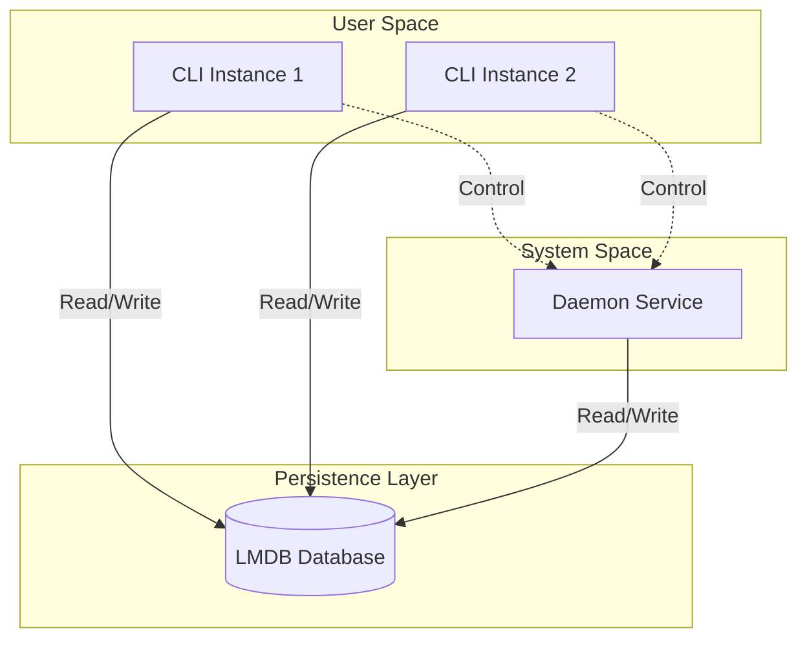

# Architecture

## Problem Statement

Sprout was designed to solve several specific challenges encountered when building robust, production-ready command-line tools and system services:

1.  **Atomic Shared State**: The need for multiple CLI instances to safely interact with a single, persistent Daemon process without race conditions or data corruption.
2.  **Cross-Process/Language IPC**: Providing a high-performance, safe mechanism for Inter-Process Communication (IPC) that is accessible from various languages, not just Go.
3.  **Self-Updating Complexity**: Abstracting the complex logic required for a binary to update itself safely, especially when running as a background service or under different user permissions.
4.  **Boilerplate Fatigue**: Eliminating the repetitive setup of standard CLI features like configuration management, logging, and graceful shutdowns.

## High-Level Architecture

Sprout follows a clean, layered architecture designed for separation of concerns and testability. The core of the application is the **App** struct, which acts as a dependency injection container, managing the lifecycle of the Database, Logger, and other platform services.

### Core Components

#### 1. The Application Container (`App`)
Located in `internal/app/app.go`, the `App` struct is the heart of Sprout. It initializes and holds references to:
-   **Configuration**: Loaded from the database.
-   **Logger**: `xlog` instance for structured logging.
-   **Database**: The LMDB wrapper instance.
-   **Network**: Base URL and server configurations.
-   **Paths**: Runtime and storage directory paths.

It also manages the application lifecycle, including a cleanup stack to ensure resources (like database handles and file locks) are released correctly upon shutdown.

#### 2. Command-Line Interface (CLI)
Built on `urfave/cli/v3`, the CLI layer (`cmd/sprout` and `internal/app/commands`) handles user interaction. Commands are registered dynamically and injected with the `App` container, giving them access to all necessary services.

#### 3. The Daemon
Sprout can run as a background service (Daemon). This mode is toggled via template variables defined in the `./scripts/*` files. The daemon leverages `systemd` for process management and `sd_notify` for status reporting (Ready, Stopping, etc.).

#### 4. The Database (LMDB)
Sprout uses **LMDB (Lightning Memory-Mapped Database)** for state management.
-   **Why LMDB?**
    -   **ACID Compliance**: Ensures data integrity even if the application crashes.
    -   **Multi-Process Concurrency**: Allows multiple CLI processes and the Daemon to read/write simultaneously without corruption.
    -   **Performance**: Extremely fast reads, making it suitable for high-frequency config checks.
    -   **IPC**: Acts as a shared memory segment, effectively serving as a language-agnostic IPC mechanism.

The database logic is encapsulated in `internal/platform/database`, providing a clean API for configuration and other data buckets (DBIs).

## Data Flow

### Configuration & State
1.  **Initialization**: When Sprout starts (CLI or Daemon), it initializes the `App` struct.
2.  **DB Connection**: It opens the LMDB environment located in `~/.sprout/db`.
3.  **Config Load**: It reads the configuration from the `config` DBI.
4.  **Execution**: The command or service logic executes, reading/writing to the DB as needed.
5.  **Shutdown**: The `App.Close()` method triggers the cleanup stack, closing the DB environment.

6.  **Shutdown**: The `App.Close()` method triggers the cleanup stack, closing the DB environment.

> [!NOTE]
> `App.Close()` is deferred in the `main` function. By default, the app closes after the command or service logic completes. If running as a daemon, it continues running until the blocking call (default: HTTP server) returns. Graceful shutdown can be triggered via `SIGINT` (Ctrl+C), `SIGTERM`, or programmatically via `app.Net.Server.Shutdown(nil)`.

### Self-Update Mechanism
The update flow is sophisticated, handling different scenarios:
1.  **Check**: Queries the Release Source (e.g., GitHub Releases) for a new version.
2.  **Update**: Re-fetches the install script and executes it.
    -   **Standard**: Runs after cleanup before exiting.
    -   **Service**: Spawns a detached process to handle the update without being killed by the service restart.

**PID Tracking & Safety**:
Each Sprout instance writes its PID to a runtime directory. The installer uses this to ensure all instances are shut down before updating, guaranteeing safe migrations.

> [!TIP]
> **Advanced Integration**
> If you have external non-Sprout processes accessing the database, you must replicate the migration guard logic found in `mguard.go`. Additionally, you'll need to modify the install script to account for these external processes during the shutdown phase of an update. As is, it's very conservative/safe and will only shut down Sprout processes.

## Directory Structure

-   `cmd/`: Main entry points (e.g., `cmd/sprout/main.go`).
-   `internal/`: Private application and platform code.
    -   `app/`: Business logic, commands, and the `App` container.
    -   `platform/`: Low-level infrastructure (Database, HTTP, Git, System).
-   `pkg/`: Publicly reusable libraries (e.g., `migrator`, `x` utilities).
-   `scripts/`: Build, install, and maintenance scripts.
