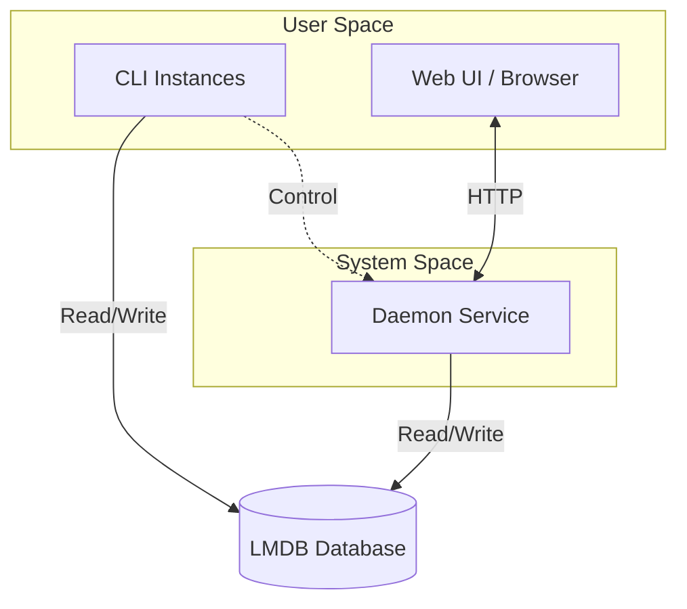

# 🌱 Sprout

**Production-grade Go CLI/Daemon framework with atomic state and self-updating superpowers.**

Sprout handles the *entire lifecycle* of a CLI application: compiling → packaging → publishing → installing → running (as a daemon) → and safely updating itself. It's the infrastructure you'd spend months building from scratch, battle-tested and ready to fork.

## Why Sprout?

Built with **love** and unhealthy amounts of caffeine. Sprout is truly a near zero-compromise solution for CLI/Daemon applications. Check this shit out:

- **How do I update a running binary without corrupting state?**: PID-tracked migration guards with cross-process file locking ensure safe, atomic updates even with multiple instances running.
- **How do multiple CLI instances share state with a background daemon?**: LMDB provides ACID-compliant, multi-process concurrent access that doubles as language-agnostic IPC.
- **How do I release without manual intervention?**: Changelog-driven CI/CD. Push a version entry, and Forgejo Actions handles the rest.
- **How do I update a systemd service without SSH access?**: Detached grandchild process spawns a shell script that stops the service, downloads the new binary, and restarts it, all triggered from a button in the web UI or cli command.
- **How do I make my frontend look pretty?**: TailwindCSS + DaisyUI, all standalone (no npm needed) with compile time cache busting... You'll be the belle of the ball.

## Workflow

| Edit Project | Create Release | Publish | Install | Update |
| :---: | :---: | :---: | :---: | :---: |
|  |  |  |  |  |
| Develop your app | Add a changelog entry | CI builds & uploads | One-liner install | Click-to-update in browser |

## Architecture

Sprout is a textbook example of **unified dependency injection**: the `App` struct holds all services (DB, Logger, Config, Server) and manages resource cleanup via a stack. For the full deep-dive, see [ARCHITECTURE.md](docs/ARCHITECTURE.md).

## Platform Support

| Platform | Status | Notes |
| :--- | :--- | :--- |
| **Linux (amd64)** | Production | Requires `systemd` for daemon functionality. |
| **Windows (WSL)** | Experimental | Fully functional via WSL, but the installation flow is experimental. |
| **macOS/BSD** | Unsupported | Lacks `systemd`, which is core to the daemon architecture. |

## Get Started

1. **[Use this Template](docs/DEVELOPMENT.md)** - Fork, configure, and build your own app
2. **[Installation Guide](docs/INSTALLATION.md)** - Template for end-user install docs

## Who Is This For?

You're building a CLI tool or system service and you want:
- Users to install and update with zero friction
- A daemon that runs reliably under systemd
- Shared state that won't corrupt across processes
- A production-grade release pipeline that fits in two ~300 line shell scripts

You're comfortable with Go, Linux, and reading source code when needed.

## License

Apache 2.0 - See [LICENSE.md](LICENSE.md) for details.

 

🩵 xoxo :3 <- that last bit is a cat, his name is sebastian and he is ultra fancy. Like, i'm not kidding, more than you initially imagined while reading that. Pinky up, drinks tea... you have no idea. Crazy.

<!--
WHOA! secrets, secret messages, hidden level! https://youtu.be/zwZISypgA9M
-->