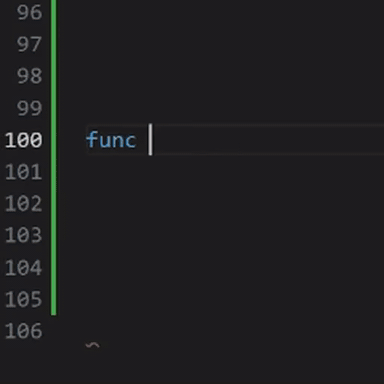
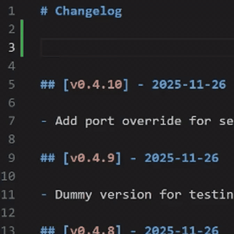
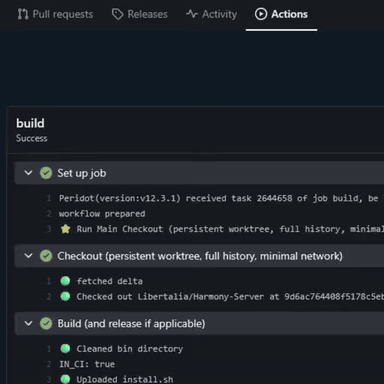
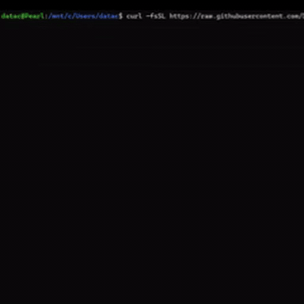

# 🌱 Sprout

**The minimal, self-updating Go CLI starter kit.**

Sprout provides a unified architecture for building production-ready command-line tools and system services. It eliminates the boilerplate of setting up robust CLI applications, offering a solid foundation that scales from simple scripts to complex daemons.

## Workflow

| Edit Project | Create Release | Publish | Install | Update |
| :---: | :---: | :---: | :---: | :---: |
|  |  |  |  |  |
| Develop your application | Create release via changelog entry | Forgejo Actions builds/uploads | Install with a single line command | Simple click-to-update notification |

## Features

- **Modern CLI Interface**: Built on `urfave/cli/v3` for a standard, portable user experience.
- **Self-Updating**: Integrated daily version checks and single-command updates.
- **Daemon Mode**: Optional systemd-managed background service capability.
- **Atomic State**: Shared LMDB database for reliable configuration/state across Daemon and CLI processes.
- **CI/CD Ready**: Automated, changelog-driven release pipeline via Forgejo Actions.
- **Cross-Platform**: Easy installation and support for Linux and Windows (WSL).

## Architecture

Sprout is designed around the principle of unified dependency injection, ensuring that your application state is consistent and easily testable. For a deep dive into the system design, see [ARCHITECTURE.md](docs/ARCHITECTURE.md).

## Get Started

- **[Use this Template](docs/DEVELOPMENT.md)**: How to fork, configure, and build your own application using Sprout.
- **[Installation Guide](docs/INSTALLATION.md)**: A template for your end-user installation instructions.

## License

Apache 2.0 - See [LICENSE.md](LICENSE.md) for details.

 

🩵 xoxo :3 <- that last bit is a cat, his name is sebastian and he is ultra fancy. Like, i'm not kidding, more than you initially imagined while reading that. Pinky up, drinks tea... you have no idea. Crazy.

<!--
WHOA! secrets, secret messages, hidden level! https://youtu.be/zwZISypgA9M
-->