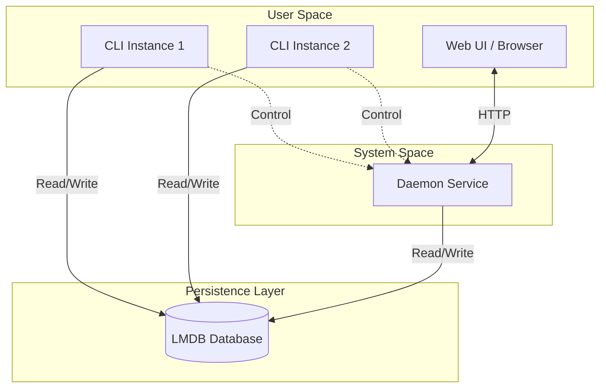

# Architecture

## Problem Statement

Sprout was designed to solve several specific challenges encountered when building robust, production-ready command-line tools and system services:

1.  **Atomic Shared State**: The need for multiple CLI instances to safely interact with a single, persistent Daemon process without race conditions or data corruption.
2.  **Cross-Process/Language IPC**: Providing a high-performance, safe mechanism for Inter-Process Communication (IPC) that is accessible from various languages, not just Go.
3.  **Self-Updating Complexity**: Abstracting the complex logic required for a binary to update itself safely, especially when running as a background service or under different user permissions.
4.  **Boilerplate Fatigue**: Eliminating the repetitive setup of standard CLI features like configuration management, logging, and graceful shutdowns.

## High-Level Architecture

Sprout follows a clean, layered architecture designed for separation of concerns and testability. The core of the application is the **App** struct, which acts as a dependency injection container, managing the lifecycle of the Database, Logger, and other platform services.



### Core Components

#### 1. The Application Container (`App`)
Located in `internal/app/app.go`, the `App` struct is the heart of Sprout. It initializes and holds references to:
-   **Configuration**: Loaded from the database.
-   **Logger**: `xlog` instance for structured logging.
-   **Database**: The LMDB wrapper instance.
-   **Network**: Base URL and server configurations.
-   **Paths**: Runtime and storage directory paths.

It also manages the application lifecycle, including a cleanup stack to ensure resources (like database handles and file locks) are released correctly upon shutdown. It also provides update functionality.

#### 2. Command-Line Interface (CLI)
Built on `urfave/cli/v3`, the CLI layer (`cmd/sprout` and `internal/app/commands`) handles user interaction. Commands are registered dynamically and injected with the `App` container, giving them access to all necessary services.

#### 3. The Daemon
Sprout can run as a background service (Daemon). This feature is toggled via template variables defined in the `./scripts/*` files. The daemon leverages `systemd` for process management and `sd_notify` for status reporting (Ready, Stopping, etc.). The service is simply an http server started via subcommand by systemd. For testing you can stop the service and run it manually in the foreground with `sprout service run`. You can also temporarily override the port in the config with `--port <port>`.

#### 4. The Database (LMDB)
Sprout uses **LMDB (Lightning Memory-Mapped Database)** for state management.
-   **Why LMDB?**
    -   **ACID Compliance**: Ensures data integrity even if the application crashes.
    -   **Multi-Process Concurrency**: Allows multiple CLI processes and the Daemon to read/write simultaneously without corruption.
    -   **Performance**: Extremely fast reads, making it suitable for high-frequency config checks.
    -   **IPC**: Acts as a shared memory segment, effectively serving as a language-agnostic IPC mechanism.

The database logic is encapsulated in `internal/platform/database`, providing a clean API for configuration and other data buckets (DBIs).

## Data Flow

### Configuration & State
1.  **Initialization**: When Sprout starts (CLI or Daemon), it initializes the `App` struct.
2.  **DB Connection**: It opens the LMDB environment located in `~/.sprout/db`. Migrates if needed.
3.  **Config Load**: It reads the configuration from the `config` DBI.
4.  **Execution**: The command or service logic executes, reading/writing to the DB as needed.
5.  **Shutdown**: The `App.Close()` method triggers the cleanup stack, closing the DB environment.

> [!NOTE]
> `App.Close()` is deferred in the `main` function. By default, the app closes after the command or service logic completes. If running as a daemon, it continues running until the blocking call (default: HTTP server) returns. Graceful shutdown can be triggered via `SIGINT` (Ctrl+C), `SIGTERM`, or programmatically via `app.Net.Server.Shutdown(nil)`.

### Self-Update Mechanism
The update flow is sophisticated, handling different scenarios:
1.  **Check**: Queries the Release Source (e.g., R2 Bucket) for a new version. Automatic checks are lazily rate-limited to once every 24 hours. Manual checks via `YOUR_APP update --check` are not rate-limited.
2.  **Update**: Re-fetches the install script and executes it.
    -   **Deferred**: Runs after cleanup before exiting.
    -   **Detached**: Spawns a detached process to handle the update. This will result in the calling process eventually being closed by the install/update script. Also this works even if under systemd.

**PID Tracking & Safety**:
Each Sprout instance writes its PID to a runtime directory. The installer uses this to ensure all instances are shut down before updating, guaranteeing safe migrations.

> [!TIP]
> **Advanced Integration**
> If you have external non-Sprout processes accessing the database, you must replicate the migration guard logic found in `mguard.go`. Additionally, you'll need to modify the install script to account for these external processes during the shutdown phase of an update. As is, it's very conservative/safe and will only shut down Sprout processes, when looping over all the PIDs in the runtime directory.

## Code Structure

This section provides a detailed breakdown of the codebase to help you navigate and extend the project.

### Directory Layout

```
sprout/
├── cmd/                           # Entry points
│   └── main.go                    # CLI bootstrap, command registration
│
├── internal/                      # Private application code (not importable externally)
│   ├── app/                       # Core application logic
│   │   ├── app.go                 # App struct (DI container), Init() lifecycle
│   │   ├── commands/              # CLI subcommands
│   │   │   ├── command.go         # Command registry pattern
│   │   │   ├── service.go         # `service run` - starts the HTTP daemon
│   │   │   ├── update.go          # `update` - manual update trigger
│   │   │   └── uninstall.go       # `uninstall` - cleanup & removal
│   │   ├── mguard.go              # Migration guard (PID-based synchronization)
│   │   └── update.go              # Auto-update logic, deferred/detached updates
│   │
│   ├── build/                     # Build-time information
│   │   └── build.go               # BuildInfo struct, ldflags injection point
│   │
│   ├── platform/                  # Infrastructure / "platform" layer
│   │   ├── database/              # LMDB wrapper and data access
│   │   │   ├── database.go        # DB initialization, DBI registry
│   │   │   ├── helpers.go         # Generic CRUD helpers (View, Put, Update, etc.)
│   │   │   ├── migration.go       # Schema migrations using pkg/migrator
│   │   │   └── config/            # Config-specific accessors
│   │   │       └── config.go      # View(), Update() for Configuration struct
│   │   │
│   │   ├── http/                  # HTTP server and routing
│   │   │   ├── router/            # Route definitions
│   │   │   │   ├── router.go      # Main router setup, middleware
│   │   │   │   └── settings/      # Settings page handlers
│   │   │   │       └── settings.go
│   │   │   └── server/            # Server lifecycle
│   │   │       └── server.go      # Wraps xhttp.Server
│   │   │
│   │   └── release/               # Update source abstraction
│   │       └── release.go         # ReleaseSource interface, version fetching
│   │
│   ├── types/                     # Shared domain types
│   │   └── types.go               # Configuration struct, defaults
│   │
│   └── ui/                        # Frontend assets
│       ├── ui.go                  # Template loading, asset serving
│       ├── assets/                # Static files (bundled via embed)
│       │   ├── css/               # Stylesheets
│       │   └── js/                # JavaScript modules
│       └── templates/             # HTML templates
│           └── settings.html
│
├── pkg/                           # Reusable libraries (importable by external projects)
│   ├── asset/                     # Versioned asset serving with cache busting
│   │   └── asset.go
│   ├── migrator/                  # Generic DB migration runner
│   │   └── migrator.go
│   ├── sdnotify/                  # systemd notification helper
│   │   └── sdnotify.go
│   └── x/                         # Utility functions
│       ├── paths.go               # Home directory, path helpers
│       └── x.go                   # Ternary, misc utils
│
├── scripts/                       # Build & deployment scripts
│   ├── build.sh                   # Main build script (ldflags, config)
│   ├── install.sh                 # Linux install/update script
│   └── install.ps1                # Windows/WSL PowerShell bridge
│
└── docs/                          # Documentation
    ├── ARCHITECTURE.md            # You are here
    ├── DEVELOPMENT.md             # Setup guide, CI/CD, runner config
    └── INSTALLATION.md            # End-user install template
```

### Key Files

| File | Purpose |
|------|---------|
| `cmd/main.go` | Entry point. Creates `App`, registers commands, runs CLI. |
| `internal/app/app.go` | The **heart** of the application. Holds all injected dependencies (`DB`, `Log`, `Server`, etc.) and manages lifecycle via cleanup stack. |
| `internal/app/commands/command.go` | Command registry pattern — add new CLI commands here. |
| `internal/app/update.go` | Self-update logic: auto-checker goroutine, `DeferUpdate()`, `DetachUpdate()`. |
| `internal/app/mguard.go` | Migration guard. Ensures only one instance runs migrations using PID files. |
| `internal/build/build.go` | Build info struct populated via `-ldflags` at compile time. |
| `internal/platform/database/database.go` | LMDB setup. Register new DBIs here. |
| `internal/platform/database/helpers.go` | Generic typed helpers for DB operations (`View`, `Put`, `Update`, `ForEach`). |
| `internal/platform/database/migration.go` | Define schema migrations using `pkg/migrator`. |
| `internal/platform/http/router/router.go` | HTTP router setup. Mount new route groups here. |
| `internal/types/types.go` | Shared configuration struct and defaults. |
| `scripts/build.sh` | Build script. App name, release URL, service settings all live here. |

### Adding New Features

#### New CLI Command
1. Create `internal/app/commands/mycommand.go`
2. Use the self-registering pattern:
   ```go
   var MyCommand = register(func(a *app.App) *cli.Command {
       return &cli.Command{
           Name:  "mycommand",
           Usage: "does something cool",
           Action: func(ctx context.Context, cmd *cli.Command) error {
               // your logic here, you have access to `a` (the App)
               return nil
           },
       }
   })
   ```
3. The `register()` call automatically adds your command to the registry — no manual list editing needed.

> The MyCommand var you create doesn't get used actually, i just prefer this pattern over using init().

#### New HTTP Route
1. Create a new package under `internal/platform/http/router/myroute/`
2. Define `Register(a *app.App, r chi.Router)` 
3. Mount in `internal/platform/http/router/router.go`:
   ```go
   myroute.Register(a, r)
   ```

#### New Database Bucket (DBI)
1. Register in `internal/platform/database/database.go`:
   ```go
   var (
       ConfigDBI = register("config")
       MyNewDBI  = register("mynew") // add here
   )
   ```
2. Create accessor package `internal/platform/database/mynew/mynew.go` (optional but recommended)
3. Use helpers from `helpers.go` for type-safe operations

#### New Database Migration
1. Add to `internal/platform/database/migration.go`:
   ```go
   m.Add("v2", "add new field to config", func(txn *lmdb.Txn) error {
       // migration logic
       return nil
   })
   ```

#### New Frontend Assets

**Static files (images, fonts, etc.):**
1. Add files to `internal/ui/assets/` (any subdirectory)
2. Access the cache-busted URL one of two ways:
   - **In handlers**: pass `a.UI.Assets["path/to/file.png"].URLPath` via template data
   - **In templates**: use the `assetPath` function: `{{ assetPath "path/to/file.png" }}`

> [!WARNING]
> Some HTML formatters don't understand Go template syntax and may do stuff like inserting spaces inside `{{ }}` expressions, breaking them. Because of that, this repo disables format-on-save for HTML files in `.vscode/settings.json`.

**Styling (TailwindCSS + DaisyUI):**
1. Edit `internal/ui/assets/css/input.css` (Tailwind source)
2. Use DaisyUI components and Tailwind utilities in your HTML templates / any other files you add

**JavaScript:**
The js files are bundled via esbuild. To add new files:
1. Add modules to `internal/ui/assets/js/src/`
2. Import from `main.js` (the entry point)

> [!NOTE]
> When the app is built, the files are hashed and added to `internal/ui/assets/manifest.json`, then embedded in the binary. Proper automatic build time cache busting <3

## Security

> [!IMPORTANT]
> Beyond the basics (checksum verification, etc.), Sprout doesn't have a full security model. It's a starter kit / template. Different applications have totally different security requirements and threat models, so you're gonna need to design and implement your own security model. TLDR; I can't really write a one-size-fits-all security model, go read the [OWASP cheatsheet series](https://cheatsheetseries.owasp.org/) if your app will be handling sensitive data.
